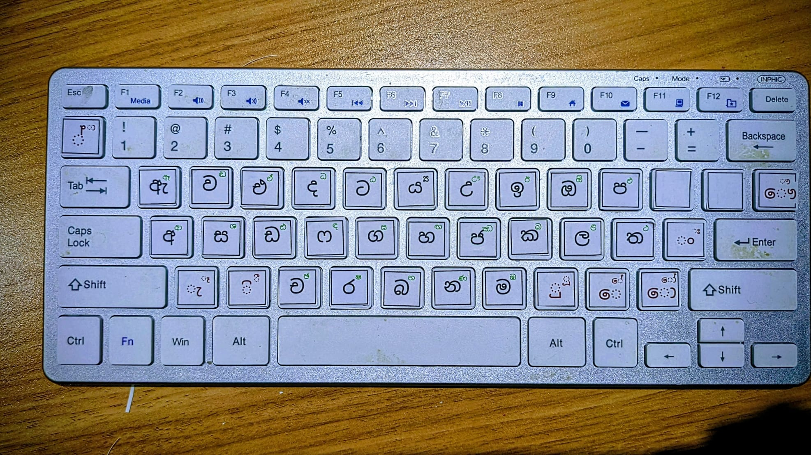

# අකුරු (Akuru)


A fun, customized keyboard application that helps kids learn to write Sinhala. Built as a personal project for my son.


## What is Akuru?

"අකුරු" (Akuru) means "letters" in Sinhala. This application provides a custom keyboard layout that maps easy-to-type key combinations to Sinhala letters. While the app is running, each keypress or key combination generates the corresponding Sinhala character, making it simple and enjoyable for children to start writing in Sinhala.

## How It Works

- The application runs in the background and intercepts keyboard input
- Each key (or combination of keys) is mapped to a specific Sinhala letter
- Children can type using a standard keyboard and see Sinhala characters appear on screen
- The mapping is designed to be intuitive and easy for young learners

## Tech Stack

- **Language:** Python
- **UI:** Tkinter (built-in, no external dependencies)
- **Platforms:** macOS, Linux (including Raspberry Pi), Windows

## Getting Started

### Prerequisites

- Python 3.7+
- Tkinter (included with most Python installations)
- A Sinhala-capable font (optional but recommended — the app will auto-detect)

### Raspberry Pi / Linux

```bash
# Install tkinter if not already present
sudo apt install python3-tk

# Recommended: install Sinhala font support
sudo apt install fonts-noto-core
```

### Setup

```bash
python3 -m venv .venv
source .venv/bin/activate
pip install -r requirements.txt
```

### Run

```bash
python main.py
```

### Run English Letters App

```bash
python -m letters.main
```

This launches a fullscreen typing console similar to Akuru, but focused on English letters (`A-Z` / `a-z`), space, enter, and backspace.

### Raspberry Pi Desktop Install (English Letters)

```bash
# Build binary on Raspberry Pi
./letters/build_pi.sh

# Install desktop launcher
./letters/install_pi.sh
```

## Usage

- **Click** any on-screen Sinhala character button to type it
- **Physical keyboard** — letters are mapped to Sinhala characters (e.g. `k` → ක, `a` → අ)



- **Backspace / Clear** — delete the last character or clear everything
- The display area at the top shows what you've typed

## License

This is a personal/educational project.
